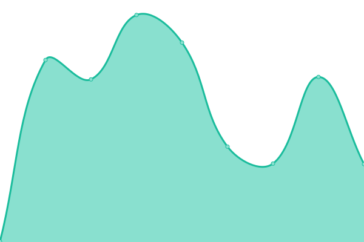
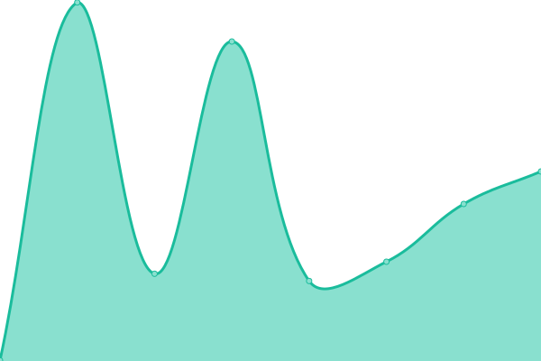

# [📈 Live Status](https://CityOfDetroit.github.io/uptime): <!--live status--> **🟩 All systems operational**

This repository contains the open-source uptime monitor and status page for [City of Detroit](https://detroitmi.gov), powered by [Upptime](https://github.com/upptime/upptime).

With [Upptime](https://upptime.js.org), you can get your own unlimited and free uptime monitor and status page, powered entirely by a GitHub repository. We use [Issues](https://github.com/CityOfDetroit/uptime/issues) as incident reports, [Actions](https://github.com/CityOfDetroit/uptime/actions) as uptime monitors, and [Pages](https://CityOfDetroit.github.io/uptime) for the status page.

<!--start: status pages-->
<!-- This summary is generated by Upptime (https://github.com/upptime/upptime) -->
<!-- Do not edit this manually, your changes will be overwritten -->
<!-- prettier-ignore -->
| URL | Status | History | Response Time | Uptime |
| --- | ------ | ------- | ------------- | ------ |
|  [City of Detroit](https://detroitmi.gov) | 🟩 Up | [city-of-detroit.yml](https://github.com/CityOfDetroit/uptime/commits/HEAD/history/city-of-detroit.yml) | 

 279ms
     
 | 

<a href="https://CityOfDetroit.github.io/uptime/history/city-of-detroit">100.00%</a>
    

|  [The Neighborhoods](https://theneighborhoods.org) | 🟩 Up | [the-neighborhoods.yml](https://github.com/CityOfDetroit/uptime/commits/HEAD/history/the-neighborhoods.yml) | 

 396ms
     
 | 

<a href="https://CityOfDetroit.github.io/uptime/history/the-neighborhoods">100.00%</a>
    

|  [Arts, Culture, and Entrepreneurship](https://ace.detroitmi.gov) | 🟩 Up | [arts-culture-and-entrepreneurship.yml](https://github.com/CityOfDetroit/uptime/commits/HEAD/history/arts-culture-and-entrepreneurship.yml) | 

 1769ms
     
 | 

<a href="https://CityOfDetroit.github.io/uptime/history/arts-culture-and-entrepreneurship">100.00%</a>
    

|  [Detroit at Work](https://detroitatwork.com) | 🟩 Up | [detroit-at-work.yml](https://github.com/CityOfDetroit/uptime/commits/HEAD/history/detroit-at-work.yml) | 

 474ms
     
 | 

<a href="https://CityOfDetroit.github.io/uptime/history/detroit-at-work">100.00%</a>
    

|  [Grow Detroit's Young Talent](https://gdyt.org) | 🟩 Up | [grow-detroit-s-young-talent.yml](https://github.com/CityOfDetroit/uptime/commits/HEAD/history/grow-detroit-s-young-talent.yml) | 

 496ms
     
 | 

<a href="https://CityOfDetroit.github.io/uptime/history/grow-detroit-s-young-talent">100.00%</a>
    

|  [Green Stormwater Infrastructure](https://detroitstormwater.org) | 🟩 Up | [green-stormwater-infrastructure.yml](https://github.com/CityOfDetroit/uptime/commits/HEAD/history/green-stormwater-infrastructure.yml) | 

 1323ms
     
 | 

<a href="https://CityOfDetroit.github.io/uptime/history/green-stormwater-infrastructure">100.00%</a>
    

|  [Detroit's Playbook](https://playbook.detroitmi.gov) | 🟩 Up | [detroit-s-playbook.yml](https://github.com/CityOfDetroit/uptime/commits/HEAD/history/detroit-s-playbook.yml) | 

 1259ms
     
 | 

<a href="https://CityOfDetroit.github.io/uptime/history/detroit-s-playbook">100.00%</a>
    

<!--end: status pages-->

[**Visit our status website →**](https://CityOfDetroit.github.io/uptime)

## 📄 License

- Powered by: [Upptime](https://github.com/upptime/upptime)
- Code: [MIT](./LICENSE) © [Anand Chowdhary](https://anandchowdhary.com), supported by [Pabio](https://pabio.com)
- Data in the `./history` directory: [Open Database License](https://opendatacommons.org/licenses/odbl/1-0/)
